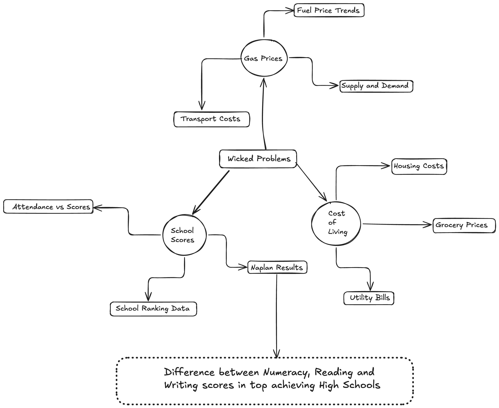

# Project Documentation

## Mind Map

### Hypothesis

Students who attend higher ranked NSW high schools achieve higher naplan numeracy scores than their reading and writing scores, suggesting that these schools perform more strongly in mathematics than in literacy based subjects.

---

### Functional Requirement

The functional requirements for my naplan data analysis program describes what the system must be able to do with the school performance data that i got from myschool website. The program is supposed to load a csv file containing naplan results and show an error if there is any type of problem in the thing. It must display the dataset in a table format so the user can view all school scores and extra stuff. The system also needs to generate a line graph comparing numeracy, reading, and writing scores across schools. For the analysis part, the program should calculate the average score for each subject and present the results clearly. It is also supposed display ranking lists for both naplan and hsc results so the user gets a better idea of the user interface. Finally, the program must provide a simple menu system so the user can easily navigate all the features in their experience.

---------

### Non functional Requirement
 
  The program must be easy for the user to understand and operate. The menu should use simple wording so the user always knows what each option does. Output such as tables, averages, and graphs must be formatted clearly. The program should guide the user through each step without confusion, even if they have never used a data analysis tool before. The system must run without crashing. It should handle invalid input by showing helpful error messages instead of just not workin. The csv file must load correctly each time. Graphs and calculations should always produce accurate results.

---

### Phase 2: The researching and planning

Data Source:  
all naplan and school performance data used in this project was obtained from the australian government education website:  
https://myschool.edu.au/

Planning and Research Steps:

- Identified the required data : School name, numeracy, reading, writing, and year.
- Chose the python library options for the data analysis:
  - I had used pandas for loading and processing csv data  
  - I also used matplotlib for generating line graphs for the visual graph representation  
- Designed a user interface to allow users to:
  - View the dataset  
  - Generate a line graph  
  - Calculate subject averages  
  - View naplan and hsc rankings  

- The different parts for my task:
  - `data_module.py` This is where all the functions are put so i can import them into the main py and would seperate them making them more neat.  
  - `main.py` This is where i import all my functions from my data module so it would print the main user interface

---

### SEEL Paragraph

The naplan data analysis program is designed to help users explore and understand school performance data through a simple and interactive menu system. The program provides multiple features such as viewing the dataset, generating graphs, calculating averages, and displaying school rankings. Each feature is separated into its own function, making the system easy to use and logically structured. An example i have is, the `show_datatable()` function prints the full dataset in a readable format, while `show_linegraph()` generates a visual comparison of Numeracy, Reading, and Writing scores using Matplotlib which was a very useful thing for my task. The `average_mean()` function calculates the mean score for each subject, and the ranking functions display naplan and hsc performance lists. These features show that the program effectively supports users in analysing school performance data. By combining numerical results, visual graphs, and ranking lists, the system makes it easier to identify trends and compare schools, demonstrating that the program meets its intended purpose.

---

### Naplan Scores Data Dictionary

|  Field   | Datatype | Format for Display | Description | Example | Validation |
|----------|----------|--------------------|-------------|---------|------------|
|  School  | str      | XX...XX            |The name of the NSW school | North Sydney Boys | Must contain letters; may include spaces |
| Numeracy | int/float| NNN                | Year 9 NAPLAN Numeracy score | 675 | Must be a number between 0–1000 |
|  Reading | int/float| NNN                | Year 9 NAPLAN Reading score | 640 | Must be a number between 0–1000 |
|  Writing | int/float| NNN                | Year 9 NAPLAN Writing score | 610 | Must be a number between 0–1000 |
|   Year   | int      | YYYY               | Year the data was recorded | 2023 | Must be a valid year |
|   Rank   | int      | NN                 | Ranking based on performance | 1 | Must be a positive whole number |

<<<<<<< HEAD

=======
>>>>>>> 60efebbff9e9362b66baf54823ba66a9b6cc0bdb
### Phase 4: Testing and Evaluating

#### Analyse and Conclude

After completing the development of my naplan data analysis program, i carried out a series of tests to check whether each feature worked as intended. Everytime i did a test the user interface worked as it showed data table, opend graph for a visual representationn and calculated the correct averages. I think that in this user interface the user cna get a good understanding of naplan scores vs school rankings.

Using my pmi reflection, i analysed the strengths and weaknesses of the solution. The clean and polished user interface made the program easy to navigate, which improved the overall user experience. However, the dataset was quite small, which limited the depth of the insights the program could generate. This meant that while the program functioned correctly, the conclusions drawn from the data were not as detailed or reliable as they could be with a larger dataset.

From the testing and pmi analysis, i concluded that the program meets the core requirements and performs all intended functions accurately. The main limitation is not the program itself, but the scope of the data available, which affects the strength of the analysis. Expanding the dataset in the future would allow the program to produce more meaningful and precise results.

---

#### Evaluate Your Project

Overall, the project was successful in meeting the functional and non functional requirements. Functionally, the program loads the data it should, displays tables that are meant to be displayed, generates graphs, calculates averages, and shows different types of rankings exactly as i expected them to. Non functionally, it is easy to use, visually clear as it is spaced out, Easy to read the code and what part does what with labeling and reliable during testing.

Evaluator for the plus minus implication: mrigaank
Plus- The user interface looks very clean and polished and provides a variety of options.
minus - the option and dataset is a bit short, this may reduce the depth and accuracy of the insights generated. 
Implication - In the future expanding the available data sources and analysis options could significantly improve the reliability and precision of the results.

The pmi reflection highlighted that the user interface is a major strength, as it is simple, organised, and visually clean. This makes the program accessible even for users with limited technical experience. The main weakness identified was the limited dataset, which reduces the accuracy and depth of the insights produced. This does not affect the program’s functionality, but it does impact the quality of the analysis.

In terms of improvements, expanding the dataset and adding more analysis options such as filtering, sorting, having an option where u can add results or comparing schools would significantly enhance the program’s usefulness. Additional visualisations like bar charts or scatter plots could also make the data easier to interpret for others and include a type of variety.

Overall, the project achieved its goals and produced a working solution that is functional, user friendly, and reliable. With more data and extended features, it can be very well used adn has rooms for further development.
